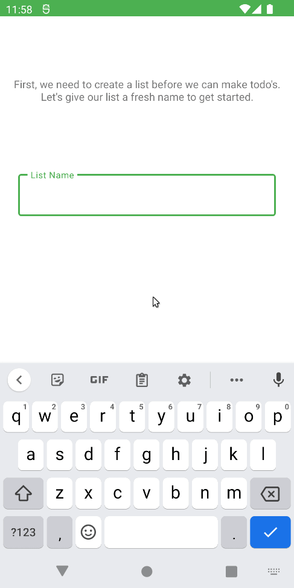
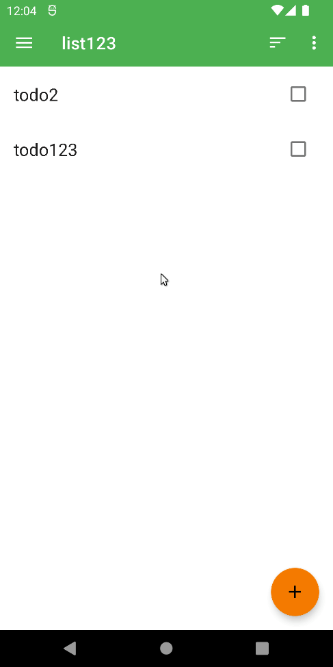
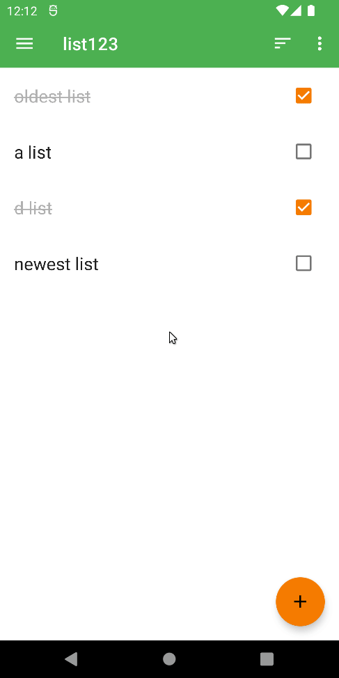

# 📝Todo

Todo helps you create multiple tasks and lists that contains them.

This app utilizes Coroutines Flow, Jetpack Room and Datastore.

Lists creating, reading, updating and deleting.

Todos creating, reading, updating and deleting.

Todos sorting and filtering.

Deleting all completed todos.

📝To-do's (for this project)

- [ ] Implement start time/end time for to-do items.
- [ ] Implement push notifications.
- [X] Implement sorting for to-do items.
